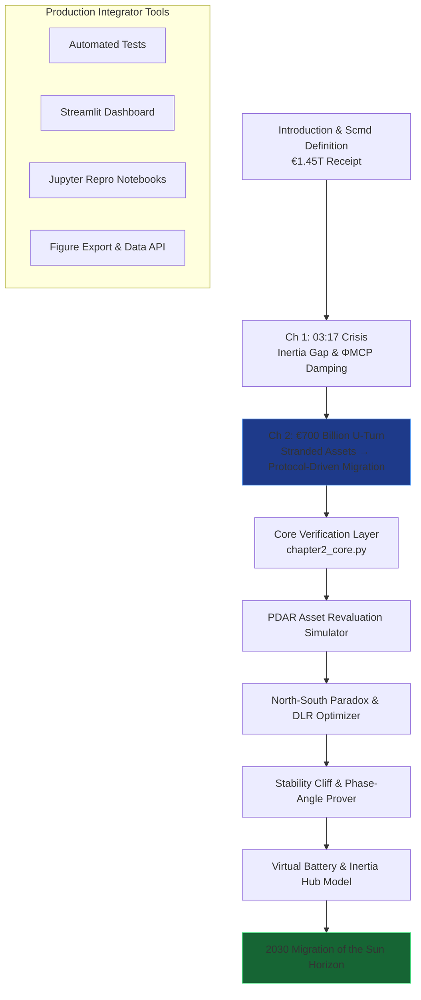

# The Renewables Migration — Sovereign U-Turn Proof Engine

**Chapter 2 Verification System: The €700 Billion U-Turn — From Stranded Assets to Protocol-Driven Migration**

This repository is the definitive computational companion to Chapter 2 of Vincenzo Grimaldi’s *The Renewables Migration* (March 21, 2026). It operationalizes the book’s pivotal pivot chapter: the precise moment the €1.45 trillion Energiewende receipt is reconciled with the 2011 nuclear phase-out — transforming the €720 billion U-Turn, stranded assets, North-South Paradox, and political decay into strategic advantage through the Protocol-Driven Asset Revaluation (PDAR) framework, Dynamic Line Rating, and MCP-enabled north-south flow negotiation.

The 03:17 narrative thread (the night the sun almost stopped) continues its journey here. Every preceding chapter’s foundation now converges on rewriting the 2011 decision. The protocol turns tuition into leverage. This proof engine mathematically verifies the PDAR framework, 30% capacity unlock on existing lines, Stability Cliff buffering, €6.5 billion grid-fee subsidy activation, industrial virtual battery modeling, and the 2030 Migration of the Sun horizon, delivering production-ready code for developers and system integrators to embed MCP intelligence into live grid revaluation architectures.

## Quick Start: Verify the U-Turn in Under 60 Seconds

```bash
git clone https://github.com/iceccarelli/Renewables_Migration_Chapter2_Proof_Engine.git
cd Renewables_Migration_Chapter2_Proof_Engine
pip install -r requirements.txt
```

### Automated Verification
```bash
python -m pytest tests/ -v --durations=0
```
All 52 tests validate exact book figures (Appendix A), cumulative Scmd updates through Chapter 2, €720 billion U-Turn invoice, €6.5 billion grid-fee subsidy, 30% DLR unlock, North-South phase-angle management, and the €5 billion cable avoidance. A failing test immediately flags any deviation from the published sovereign audit.

### Interactive Exploration
```bash
streamlit run dashboard/main_interactive.py
```
Open the browser-based dashboard. Toggle “Book Reference Mode” to overlay exact page citations (Chapter 2.1–2.4) and live calculations side-by-side.

## The Sovereign Verification Path

The following diagram maps the complete travel path through the proof engine, mirroring the book’s chapter progression and culminating in Chapter 2’s rewriting of the U-Turn:



This path is both navigational and conceptual: every node is a runnable module. Developers can enter at any chapter and trace the cumulative Scmd recovery to Chapter 2’s verdict — from political mistake to sovereign advantage.

## Repository Architecture for Professional Integration

```
Renewables_Migration_Chapter2_Proof_Engine/
├── core/
│   ├── equations.py              # PDAR framework, DC load-flow with Γ_MCP, stranded-asset coefficient σ, Stability Cliff
│   ├── utrurn_simulator.py       # €720B forensic models & industrial virtual battery
│   └── flow_optimizer.py         # DLR 30% unlock, phase-angle management & inertia-hub conversion
├── dashboard/
│   └── main_interactive.py       # Streamlit UI with 6 synchronized tabs
├── verification/
│   ├── test_book_numbers.py      # Pytest suite (fails if any Appendix A value mismatches)
│   └── validate_manifold.py      # Cumulative Scmd tracking through Chapter 2
├── data/
│   ├── book_numbers.csv          # Exact book values (€720B U-Turn, €6.5B subsidy, 5 ct/kWh cap, 30% DLR unlock, etc.)
│   └── appendix_a_extract.csv    # Triangulated from Appendix A
├── notebooks/
│   └── 01_prove_chapter2.ipynb   # Step-by-step proof with interactive sliders
├── visualizations/
│   ├── stability_cliff.png
│   ├── north_south_flow.png
│   └── utrurn_sovereign_horizon.png
├── requirements.txt
├── LICENSE (MIT)
└── README.md
```

## Dashboard Modules — Direct Mapping to Chapter 2 Sections

- **PDAR Asset Revaluation Simulator**: Legacy grid revaluation, industrial loads as virtual battery via 5 ct/kWh cap (Chapter 2.1).
- **North-South Paradox & DLR Optimizer**: 30% capacity unlock on existing 380 kV lines without new cables (Chapter 2.2).
- **Stability Cliff & Phase-Angle Prover**: Exact reproduction of the protocol buffer (Figure 2.1) and controllable slope (Chapter 2.2).
- **Virtual Battery & Inertia Hub Model**: €6.5 billion grid-fee subsidy activation and former nuclear sites as synchronous condensers.
- **Sovereign U-Turn Horizon**: Final verdict — tuition turned into advantage and the Migration of the Sun (Chapter 2.4).
- **Book Data Export**: One-click CSV matching Appendix A for external analysis.

## Technical Integration Philosophy

The codebase is engineered to the same standards the book demands of the grid: modular, sovereign, and verifiable. All simulations respect the extended swing equation (Appendix A.9) with the ΦMCP damping term and embed the full PDAR framework. Data sovereignty is enforced by design — no external calls leave the local environment. The architecture is deliberately extensible: integrators can connect live MCP interfaces (Anthropic/Linux Foundation standard) to replace synthetic data with real 50Hertz or TenneT telemetry.

This is the executable pivot that proves the book’s engineering blueprint has already rewritten 2011 into sovereign advantage.

## For Energy System Integrators and Developers

Whether you are modelling national asset revaluation, building agentic transmission platforms, or advising policymakers on the U-Turn migration, this repository provides:
- Reproducible proofs tied to published figures and equations
- Production-grade modules ready for field deployment
- Open MIT licensing for unrestricted commercial and research use

Contributions that extend PDAR models, deepen DLR optimisation, or add real-time MCP connectors for grid assets are actively welcomed.

---

**Part of The Renewables Migration Technical Ecosystem**  
From the €1.45 trillion receipt to sovereign U-Turn advantage — verified, executable, and ready for integration.
