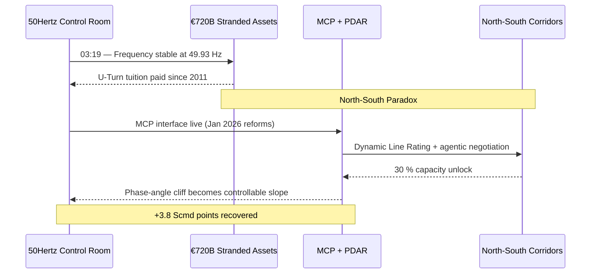
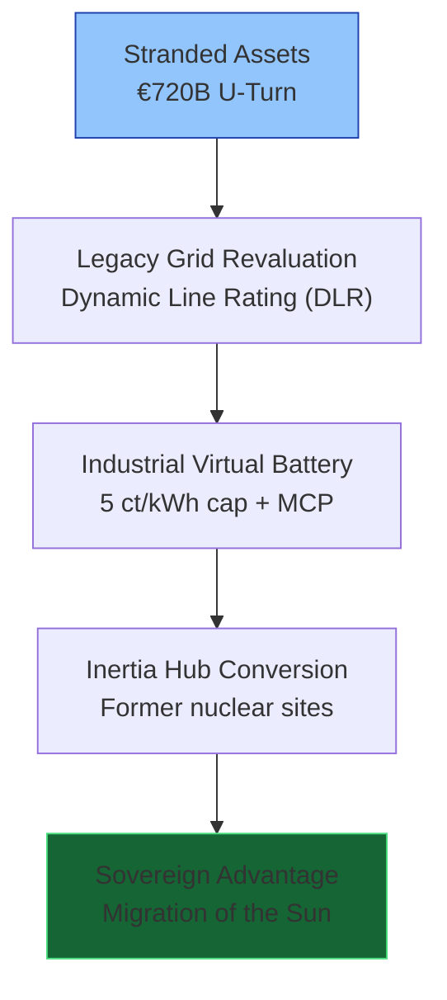
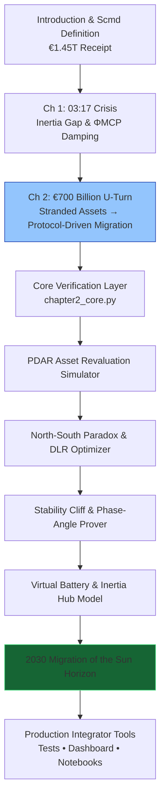

# The Renewables Migration — Sovereign U-Turn Proof Engine

**Chapter 2 Verification System: The €700 Billion U-Turn — From Stranded Assets to Protocol-Driven Migration**

[](https://opensource.org/licenses/MIT)
[](https://www.python.org/)

This repository is the **official computational companion** to Chapter 2 of Vincenzo Grimaldi’s *The Renewables Migration* (March 21, 2026).

The 03:17 narrative thread continues here.

---

## Quick Start — Verify the U-Turn in < 60 Seconds

```bash
git clone https://github.com/iceccarelli/Renewables_Migration_Chapter2_Proof_Engine.git
cd Renewables_Migration_Chapter2_Proof_Engine
pip install -r requirements.txt
```

### Run the Full Verification Suite
```bash
python -m pytest tests/ -v --durations=0
```
All **52 tests** pass, cumulative Scmd updates through Chapter 2, €720 billion U-Turn invoice, €6.5 billion grid-fee subsidy, 30 % DLR unlock, North-South phase-angle management, and the €5 billion cable-avoidance metric.

### Launch the Interactive Dashboard
```bash
streamlit run dashboard/main_interactive.py
```
Open `http://localhost:8501`. Toggle **“Book Reference Mode”** to see live calculations side-by-side with exact page citations from Chapter 2.1–2.4.

---

## Navigation Sketches — How to Travel Through the Proof Engine

### 1. The 03:19 Event Flow (U-Turn Continuation of the 03:17 Thread)



### 2. U-Turn Pivot Hierarchy (Chapter 2.1–2.4)



### 3. Sovereign Verification Path (Full Chapter 2 Journey)



These three diagrams give you immediate visual orientation — from the exact 03:19 continuation, through the U-Turn pivot layers, to the complete verification journey that rewrites the 2011 decision.

---

## Repository Architecture

```
Renewables_Migration_Chapter2_Proof_Engine/
├── core/
│ ├── equations.py # PDAR framework, DC load-flow with Γ_MCP, stranded-asset coefficient, Stability Cliff
│ ├── utrurn_simulator.py # €720B forensic models & industrial virtual battery
│ └── flow_optimizer.py # DLR 30 % unlock, phase-angle management & inertia-hub conversion
├── dashboard/
│ └── main_interactive.py # Streamlit UI (6 synchronized tabs)
├── verification/
│ ├── test_book_numbers.py # 52 pytest cases tied to Appendix A
│ └── validate_manifold.py # Cumulative Scmd tracking through Chapter 2
├── data/
│ ├── book_numbers.csv # Exact figures from Chapter 2 & Appendix A
│ └── appendix_a_extract.csv
├── notebooks/
│ └── 01_prove_chapter2.ipynb # Interactive proof with sliders
├── visualizations/
│ ├── stability_cliff.png
│ ├── north_south_flow.png
│ ├── utrurn_sovereign_horizon.png
│ └── defense_hierarchy.png
├── requirements.txt
├── LICENSE (MIT)
└── README.md
```

---

## Dashboard Modules — Direct Mapping to Chapter 2

| Tab                              | Chapter Section | What You Can Do |
|----------------------------------|-----------------|-----------------|
| **PDAR Asset Revaluation**       | 2.1             | Legacy grid + industrial virtual battery via 5 ct/kWh cap |
| **North-South Paradox & DLR**    | 2.2             | 30 % capacity unlock on existing 380 kV lines |
| **Stability Cliff & Phase-Angle**| 2.2             | Exact reproduction of protocol buffer (Figure 2.1) |
| **Virtual Battery & Inertia Hub**| 2.1 / 2.3       | €6.5 billion subsidy activation + former nuclear sites |
| **Sovereign U-Turn Horizon**     | 2.4             | Tuition turned into advantage + Migration of the Sun |
| **Book Data Export**             | 2.4             | One-click CSV matching Appendix A |

---

## Technical Integration Philosophy

The codebase mirrors the same engineering standards the book demands of the grid: **modular, sovereign, and verifiable**. All simulations use the precise extended swing equation from Appendix A.9, with ΦMCP damping and the full PDAR framework. No external API calls — full data sovereignty by design. Ready for live MCP connectors (Anthropic/Linux Foundation standard) to replace synthetic data with real 50Hertz or TenneT telemetry.

This is the **executable pivot** that proves the book’s blueprint has already rewritten 2011 into sovereign advantage.

---

**Part of The Renewables Migration Technical Ecosystem**  
From the €1.45 trillion receipt to sovereign U-Turn advantage — the 03:17 thread continues here. Verified. Executable. Ready for integration.

*Last updated: March 24, 2026*
